<p align="center">
  
</p>

<picture>
  <source media="(prefers-color-scheme: dark)" srcset="https://raw.githubusercontent.com/SUNGMYEONGGI/SUNGMYEONGGI/token-assets/assets/token-activity-dark.svg" />
  <source media="(prefers-color-scheme: light)" srcset="https://raw.githubusercontent.com/SUNGMYEONGGI/SUNGMYEONGGI/token-assets/assets/token-activity-light.svg" />
  
</picture>

<br />


#### 🤖 Claude Code Usage
<!-- CLAUDE-USAGE:START -->
**모델별**

```
Opus 5          1.2B  ███████████████████░░░   86.7%
Sonnet 5      134.4M  ██░░░░░░░░░░░░░░░░░░░░    9.9%
Fable 5        32.2M  █░░░░░░░░░░░░░░░░░░░░░    2.4%
Fable 5 1      12.8M  ▏░░░░░░░░░░░░░░░░░░░░░    0.9%
Opus 4.8      659.2K  ▏░░░░░░░░░░░░░░░░░░░░░    0.0%
```

**기간별**

```
          Daily (last 7)           |                Weekly               |               Monthly             
---------------------------------  |  ---------------------------------  |  ---------------------------------
08-30      3.4M  ▏░░░░░░░░░  0.7%  |  07-06     22.5M  ▏░░░░░░░░░  1.7%  |  2026-07   52.3M  ▏░░░░░░░░░  3.9%
08-31     13.0M  ▏░░░░░░░░░  2.7%  |  07-13     26.3M  ▏░░░░░░░░░  1.9%  |  2026-08  843.0M  ██████░░░░ 62.2%
09-01    177.7M  ████░░░░░░ 37.4%  |  07-20      3.4M  ▏░░░░░░░░░  0.2%  |  2026-09  459.1M  ███░░░░░░░ 33.9%
09-02     53.5M  █░░░░░░░░░ 11.3%  |  07-27     23.0M  ▏░░░░░░░░░  1.7%  |                                   
09-03    111.8M  ██░░░░░░░░ 23.5%  |  08-03    165.9M  █░░░░░░░░░ 12.3%  |                                   
09-04     60.8M  █░░░░░░░░░ 12.8%  |  08-10    434.4M  ███░░░░░░░ 32.1%  |                                   
09-05     55.3M  █░░░░░░░░░ 11.6%  |  08-17    121.3M  █░░░░░░░░░  9.0%  |                                   
                                   |  08-24     85.6M  █░░░░░░░░░  6.3%  |                                   
                                   |  08-31    472.1M  ███░░░░░░░ 34.9%  |                                   
```

<sub>I'm an Opus 5 main 🧠 · 1.4B tokens · 39d (2026-07-12 → 2026-09-05)</sub>
<!-- CLAUDE-USAGE:END -->
